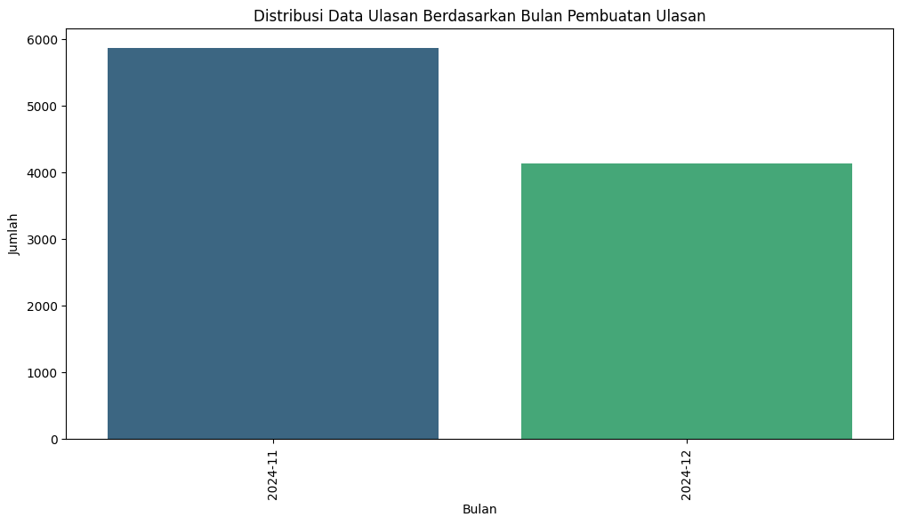
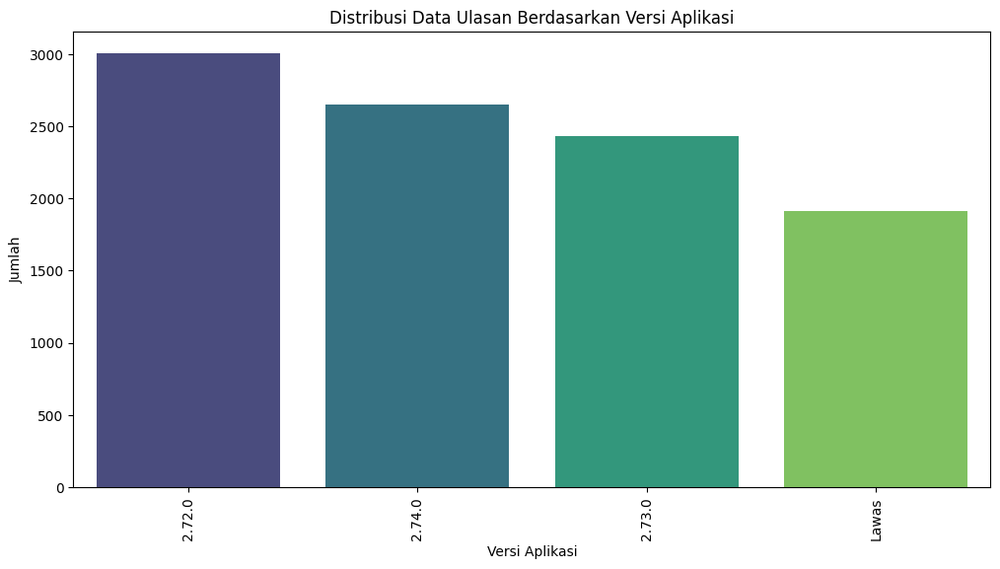
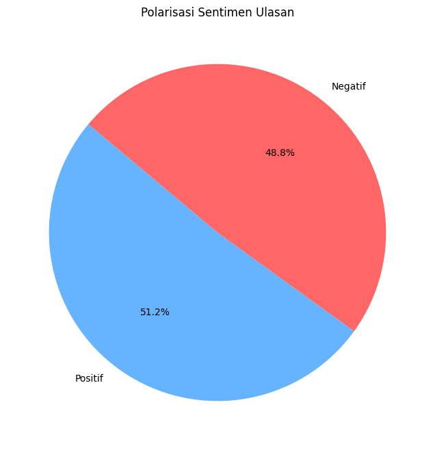
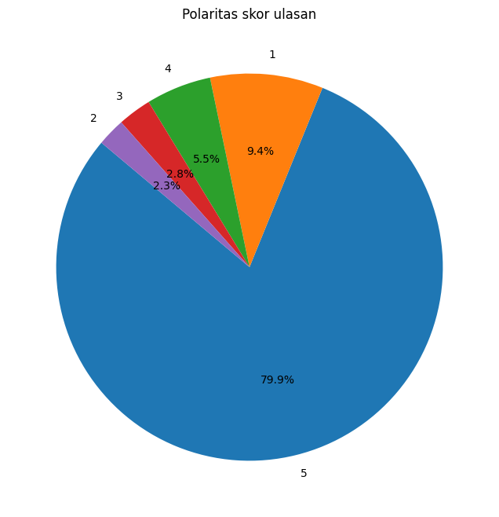
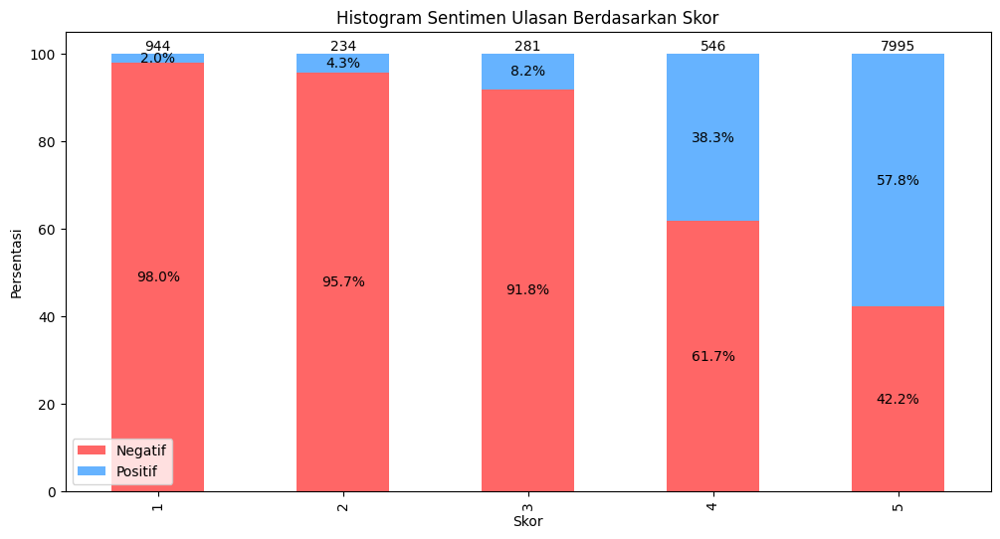

# BRIMO Google Play Review Sentiment Analysis

Proyek ini bertujuan untuk menganalisis sentimen dari ulasan pengguna BRIMO di Google Play. Data akan diolah untuk mengidentifikasi sentimen positif, dan negatif.

## Fitur
- Pengumpulan dan praproses data ulasan
- Labelling menggunakan w11wo/indonesian-roberta-base-indolem-sentiment-classifier-fold-0 via huggingface
- Klasifikasi sentimen berbasis model SVM
- Laporan singkat tentang hasil analisis

## Visualisasi
### Distribusi Ulasan Berdasarkan Bulan Pembuatan Ulasan

### Distribusi Ulasan Berdasarkan Versi Aplikasi

### Polaritas Sentimen Ulasan

### Polaritas Skor Ulasan

### Sentiment Ulasan Berdasarkan Skor

## Lisensi
Bebas digunakan dan dimodifikasi sesuai kebutuhan dengan Izin Author. digunakan untuk penelitian tugas akhir RISWAN.